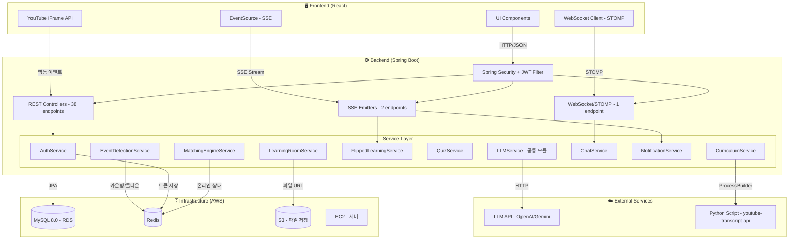

# CLAUDE.md
> **구현 범위: Backend (Spring Boot) + Infrastructure만 구현 대상입니다. Frontend 코드는 작성하지 않습니다.**

This file provides guidance to Claude Code (claude.ai/code) when working with code in this repository.

## Project Overview

MoAI (AI-based Study Platform) backend — Spring Boot 3.5 application on Java 17. Stack: MySQL + Redis + AWS S3, JWT auth, STOMP/WebSocket for chat, SSE for real-time notifications and flipped-learning events, WebFlux `WebClient` for LLM calls, Apache PDFBox for material generation, and a Python subprocess (`youtube-transcript-api`) for subtitle scraping.

## Reference docs

- `docs/api_spec.md` — REST/SSE/WebSocket endpoint contracts
- `docs/architecture.md` — detailed flows and sequence diagrams
- `docs/db_schema.md` — table definitions and relationships

## Build & Run Commands

```bash
# Build
./gradlew build

# Run application
./gradlew bootRun

# Run all tests
./gradlew test

# Run a single test class
./gradlew test --tests "com.moai.backend.SomeTest"

# Start infrastructure (MySQL 8.0 + Redis)
docker-compose up -d
```

## Required Environment Variables

- `DB_URL` — JDBC connection string (e.g. `jdbc:mysql://localhost:3306/moai_db`)
- `DB_USERNAME` / `DB_PASSWORD` — MySQL credentials
- `JWT_SECRET_KEY` — HMAC-SHA signing key for JWT tokens
- `LLM_API_KEY` — LLM API key (OpenAI or Gemini)
- `LLM_API_URL` — LLM API endpoint URL
- `LLM_MODEL` — Model name to use (e.g. gpt-4o)

## Architecture

### Package layout: `com.moai.backend`

- **`domain/{feature}/`** — feature-based modules, each with `controller/`, `service/`, `dto/`, `entity/`, `repository/` sub-packages. Current domains:
  - `auth` — login/logout/token reissue
  - `users` — signup, user entity, mypage
  - `onboarding` — initial user keyword/interest setup
  - `learningroom` — learning room CRUD, file URLs via S3
  - `curriculum` — LLM-driven weekly curriculum + YouTube video_id recommendation
  - `transcript` — subtitle scraping (Python subprocess) + storage
  - `material` — week-level study materials (PDF via PDFBox)
  - `flipped` — 거꾸로 학습 (flipped-learning) flow, SSE-driven
  - `quiz` — final quiz generation, async grading, AI analysis report
  - `keyword` — strength/weakness keyword aggregation
  - `eventlog` — YouTube-IFrame behavior events → Redis pattern detection
  - `study` — matching engine + study proposals (uses Redis online state)
  - `chat` — STOMP/WebSocket real-time chat + offline-notification bridge
  - `notification` — SSE push + mypage history
- **`global/`** — cross-cutting concerns:
  - `auth/` — `JwtTokenProvider` (token creation/validation/parsing, access/refresh `token_type` claim), `JwtAuthenticationFilter` (Spring Security filter)
  - `config/` — `SecurityConfig` (stateless JWT), `RedisConfig`, WebSocket/STOMP config
  - `common/` — `ApiResponse<T>` (standard success wrapper), `BaseTimeEntity`
  - `exception/` — `CustomException(status, code, message)`, `GlobalExceptionHandler`
  - `llm/` — shared `LlmService` (WebClient-based), `LlmConfig`, request/response DTOs. All LLM calls go through this module
  - `s3/` — `S3Service` / `S3Config` (AWS SDK v2) for learning-room file URLs
  - `subtitle/` — `SubtitleScraperService` invokes `scripts/subtitle_scraper.py` via `ProcessBuilder`
  - `material/` — `MaterialGeneratorService` + `MaterialContent` (PDF output)

### Key patterns

- **Stateless JWT auth**: Access token (30min) + Refresh token (14 days) with a `token_type` claim to distinguish them (refresh-only endpoints reject access tokens and vice versa). Refresh tokens stored in Redis (`RT:{email}`). Logout blacklists access tokens in Redis with remaining TTL.
- **API response format**: All success responses use `ApiResponse.success(status, message, data)`. Errors use `ErrorResponse` with `status`, `code`, `message`.
- **Exception handling**: Throw `CustomException(httpStatus, errorCode, message)` — caught globally by `GlobalExceptionHandler`.
- **Security permit paths**: Only /api/auth/register, /api/auth/login, and /api/auth/refresh are public; all other endpoints require a valid JWT.
- **Entities**: Use `@Builder` with protected no-arg constructor. Passwords stored BCrypt-encoded.
- **DTOs**: Use Lombok `@Getter` and Jakarta Validation annotations (`@NotBlank`, `@Email`, etc.).
- **Transactions**: Service classes default to `@Transactional(readOnly = true)` at class level; write operations override with `@Transactional`.
- **Strict Layered Architecture**: 비즈니스 로직은 절대 Controller에 작성하지 않고 오직 Service 계층에만 구현합니다. Controller는 프론트엔드와의 데이터 교환(DTO 변환 및 응답)만 담당합니다.
- **Real-time channels**:
  - SSE emitters: flipped-learning event stream + notification push (requires JWT via query param or header — see `SecurityConfig`)
  - STOMP/WebSocket: chat. Offline recipients fall back to notification-table + SSE
- **LLM calls**: always via `global/llm/LlmService` (reactive `WebClient`). Domains never instantiate their own HTTP client for LLM.

### Infrastructure

- MySQL 8.0 on port 3306 (database: `moai_db`) — production/local runtime
- Redis on port 6379 (token storage, blacklist, event counters, online-presence)
- Tests use H2 in-memory (`testRuntimeOnly 'com.h2database:h2'`) — running `./gradlew test` does NOT require a live MySQL/Redis.
- JPA `ddl-auto: update` — schema managed by Hibernate
- Config file is `src/main/resources/application.yaml` (not `application.yml`). `subtitle.script-path` points at the Python scraper.
- The deployment environment (and local) must have Python 3 and `youtube-transcript-api` installed.

### Key dependencies (non-obvious)

- `io.jsonwebtoken:jjwt 0.12.3` — JWT signing/parsing
- `software.amazon.awssdk:s3` (AWS SDK v2, BOM 2.42.26) — S3 file URLs
- `org.apache.pdfbox:pdfbox 3.0.4` — PDF material generation
- `spring-boot-starter-websocket` — STOMP chat
- `spring-boot-starter-webflux` — `WebClient` for LLM calls (no reactive endpoints; MVC stack remains the default)

### System Architecture

### 핵심 비즈니스 로직

- **패턴 감지**: Redis 기반 카운팅. 키 `moai:events:{userId}:{videoId}:{eventType}` (TTL 10분), 쿨다운 `moai:cooldown:{userId}:{videoId}:{pattern}` (TTL 5분)
- **진척도**: 영상 시청 40% + 거꾸로 학습 30% + 파이널 퀴즈 30%. 학습실 전체 달성률 = 주차별 평균
- **매칭 엔진**: 약점 키워드 weakness_count >= 2 + 동일 키워드 strength 보유자 + created_at 7일 이내 + Redis 토큰 존재(온라인)
- **자막 스크래핑**: Python 스크립트 경로 `src/main/resources/scripts/subtitle_scraper.py`.
  application.yml `subtitle.script-path` 프로퍼티로 관리.
  ProcessBuilder로 호출, 실패 시 해당 주차 VideoTranscripts 빈 값으로 저장하고 계속 진행.
- **LLM 연동**: 프롬프트 설계는 AI 담당이 별도 진행. 백엔드는 LLMService 공통 모듈로 호출만 담당
- **상세 흐름**: `docs/architecture.md` 참조
- **YouTube 영상 추천**: LLM이 주차별 topic 기반으로 YouTube video_id를 직접 추천.
    YouTube Data API 미사용.
    자막 스크래핑 실패 시 해당 주차 resources는 빈 배열로 저장하고 계속 진행.
- **퀴즈 응시 이력 조회**: api_spec의 GET /api/learning-rooms/{roomId}/quiz-attempts는 GET /api/learning-rooms/{roomId}/curriculum/{weekId}/quiz-attempts로 변경.

## Commit Message Format

사용자가 **"깃허브 변경사항 설명"** 이라고 말하면, 아래 형식으로 커밋 제목과 상세 설명을 작성한다.

**형식 규칙**
- 제목: `feat:` / `fix:` / `refactor:` 등 prefix + 한 줄 요약 (한국어)
- 상세: 변경 단위(Phase 또는 기능명)별로 구분, 각 항목마다 파일 경로 + 변경 내용을 `—` 로 서술
- 파일 경로는 `domain/…` / `global/…` 형태(패키지 기준 축약)로 표기
- 신규 파일은 "신규", 기존 수정은 "수정"으로 명시

**예시 출력 형식**
```
feat: [변경 요약 제목]

  [기능/Phase명]
  - 파일경로.java 신규/수정 — 구체적 변경 내용
  - 파일경로.java 수정 — 구체적 변경 내용

  [기능/Phase명 2]
  - 파일경로.java 수정 — 구체적 변경 내용
```

## RTK Mode (Windows)

You are running in RTK compatibility mode on Windows.

- Always prefix executable commands with `rtk`.
- Never output raw commands without `rtk`.
- Do not rely on hook-based injection.
- When suggesting terminal commands, convert:

git status -> rtk git status
npm test -> rtk npm test
gradle build -> rtk gradle build
docker compose up -> rtk docker compose up

