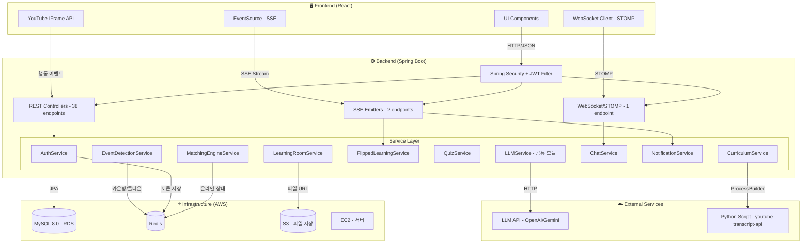

~~# CLAUDE.md
> **구현 범위: Backend (Spring Boot) + Infrastructure만 구현 대상입니다. Frontend 코드는 작성하지 않습니다.**

This file provides guidance to Claude Code (claude.ai/code) when working with code in this repository.

## Project Overview

MoAI (AI-based Study Platform) backend — Spring Boot 3.5 application with Java 17, using MySQL, Redis, and JWT-based authentication.

## Build & Run Commands

```bash
# Build
./gradlew build

# Run application
./gradlew bootRun

# Run all tests
./gradlew test

# Run a single test class
./gradlew test --tests "com.moai.backend.SomeTest"

# Start infrastructure (MySQL 8.0 + Redis)
docker-compose up -d
```

## Required Environment Variables

- `DB_URL` — JDBC connection string (e.g. `jdbc:mysql://localhost:3306/moai_db`)
- `DB_USERNAME` / `DB_PASSWORD` — MySQL credentials
- `JWT_SECRET_KEY` — HMAC-SHA signing key for JWT tokens
- `LLM_API_KEY` — LLM API key (OpenAI or Gemini)
- `LLM_API_URL` — LLM API endpoint URL
- `LLM_MODEL` — Model name to use (e.g. gpt-4o)

## Architecture

### Package layout: `com.moai.backend`

- **`domain/{feature}/`** — feature-based modules, each with `controller/`, `service/`, `dto/`, `entity/`, `repository/` sub-packages
  - Current domains: `auth` (login/logout/token reissue), `users` (signup, user entity)
- **`global/`** — cross-cutting concerns:
  - `auth/` — `JwtTokenProvider` (token creation/validation/parsing), `JwtAuthenticationFilter` (Spring Security filter)
  - `config/` — `SecurityConfig` (stateless JWT security chain), `RedisConfig`
  - `common/` — `ApiResponse<T>` (standard success wrapper), `BaseTimeEntity`
  - `exception/` — `CustomException(status, code, message)`, `GlobalExceptionHandler`

### Key patterns

- **Stateless JWT auth**: Access token (30min) + Refresh token (14 days). Refresh tokens stored in Redis (`RT:{email}`). Logout blacklists access tokens in Redis with remaining TTL.
- **API response format**: All success responses use `ApiResponse.success(status, message, data)`. Errors use `ErrorResponse` with `status`, `code`, `message`.
- **Exception handling**: Throw `CustomException(httpStatus, errorCode, message)` — caught globally by `GlobalExceptionHandler`.
- **Security permit paths**: Only /api/auth/register, /api/auth/login, and /api/auth/refresh are public; all other endpoints require a valid JWT.
- **Entities**: Use `@Builder` with protected no-arg constructor. Passwords stored BCrypt-encoded.
- **DTOs**: Use Lombok `@Getter` and Jakarta Validation annotations (`@NotBlank`, `@Email`, etc.).
- **Transactions**: Service classes default to `@Transactional(readOnly = true)` at class level; write operations override with `@Transactional`.
- **Strict Layered Architecture**: 비즈니스 로직은 절대 Controller에 작성하지 않고 오직 Service 계층에만 구현합니다. Controller는 프론트엔드와의 데이터 교환(DTO 변환 및 응답)만 담당합니다.

### Infrastructure

- MySQL 8.0 on port 3306 (database: `moai_db`)
- Redis on port 6379 (token storage and blacklist)
- JPA `ddl-auto: update` — schema managed by Hibernate
- The deployment environment (and local) must have Python 3 and 'youtube-transcript-api' installed.

### System Architecture

### 핵심 비즈니스 로직

- **패턴 감지**: Redis 기반 카운팅. 키 `moai:events:{userId}:{videoId}:{eventType}` (TTL 10분), 쿨다운 `moai:cooldown:{userId}:{videoId}:{pattern}` (TTL 5분)
- **진척도**: 영상 시청 40% + 거꾸로 학습 30% + 파이널 퀴즈 30%. 학습실 전체 달성률 = 주차별 평균
- **매칭 엔진**: 약점 키워드 weakness_count >= 2 + 동일 키워드 strength 보유자 + created_at 7일 이내 + Redis 토큰 존재(온라인)
- **자막 스크래핑**: Python 스크립트 경로 `src/main/resources/scripts/subtitle_scraper.py`.
  application.yml `subtitle.script-path` 프로퍼티로 관리.
  ProcessBuilder로 호출, 실패 시 해당 주차 VideoTranscripts 빈 값으로 저장하고 계속 진행.
- **LLM 연동**: 프롬프트 설계는 AI 담당이 별도 진행. 백엔드는 LLMService 공통 모듈로 호출만 담당
- **상세 흐름**: `docs/architecture.md` 참조
- **YouTube 영상 추천**: LLM이 주차별 topic 기반으로 YouTube video_id를 직접 추천.
    YouTube Data API 미사용.
    자막 스크래핑 실패 시 해당 주차 resources는 빈 배열로 저장하고 계속 진행.

