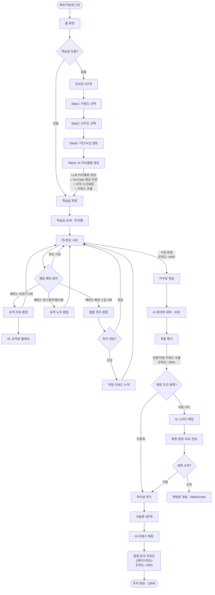
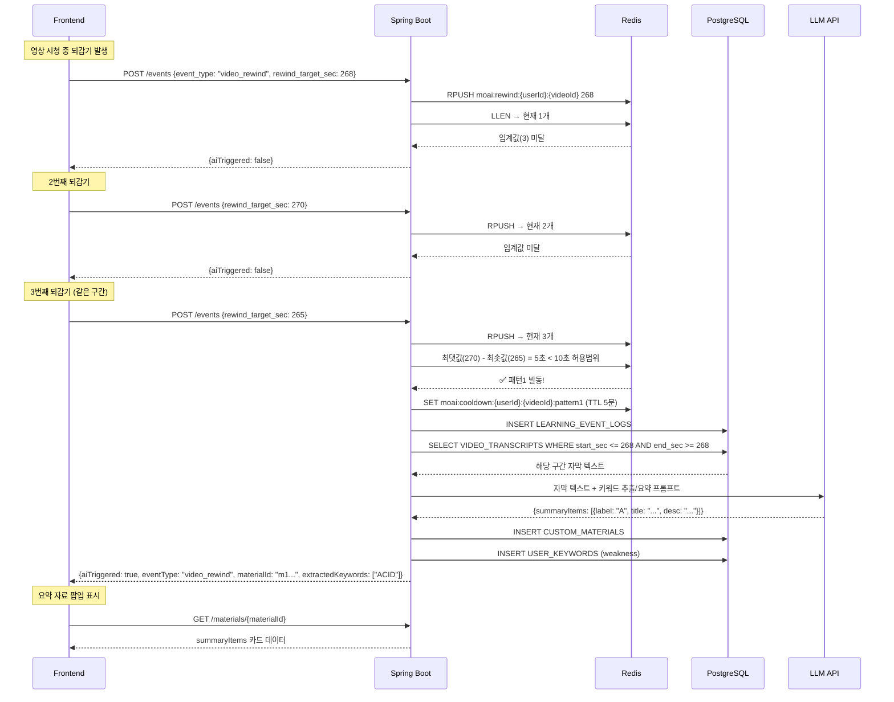
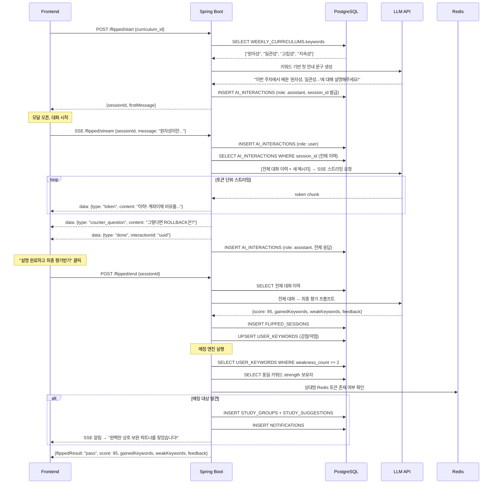
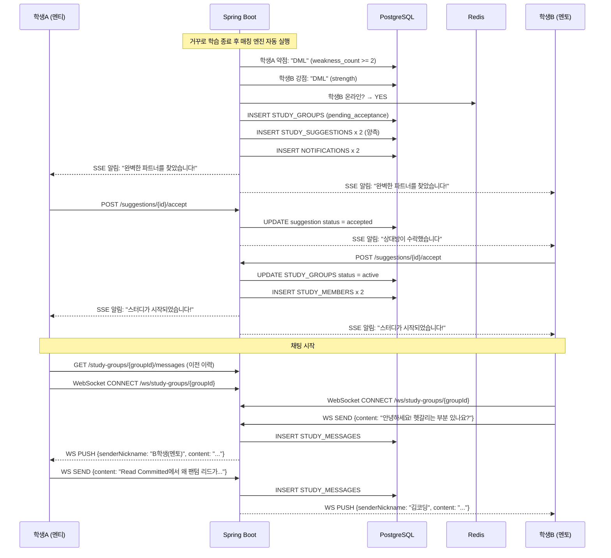
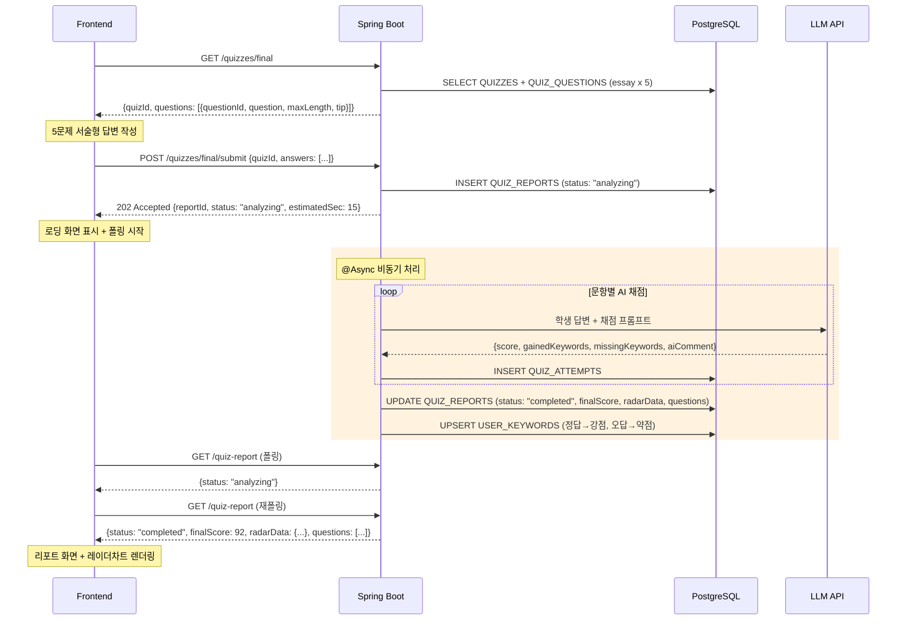
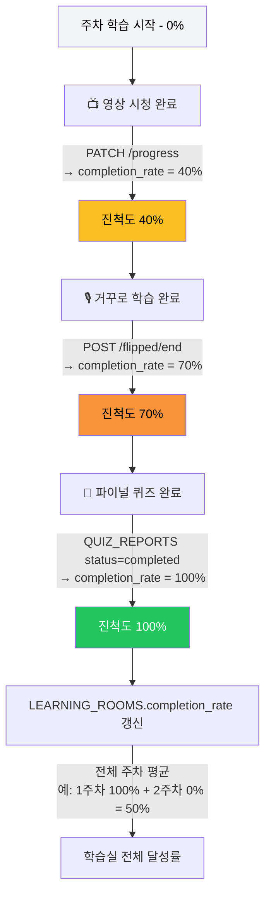

## 2. 핵심 사용자 흐름 (Main User Flow)

---

## 3. 패턴 감지 데이터 흐름 (Pattern Detection Flow)

---

## 4. 거꾸로 학습 흐름 (Flipped Learning Flow)

---

## 5. 학습실 생성 파이프라인 (Learning Room Creation Pipeline)

---

## 6. 스터디 매칭 + 채팅 흐름 (Study Matching & Chat Flow)

---

## 7. 파이널 퀴즈 + AI 리포트 흐름 (Final Quiz Flow)

---

## 8. 진척도 계산 흐름 (Completion Rate Flow)

